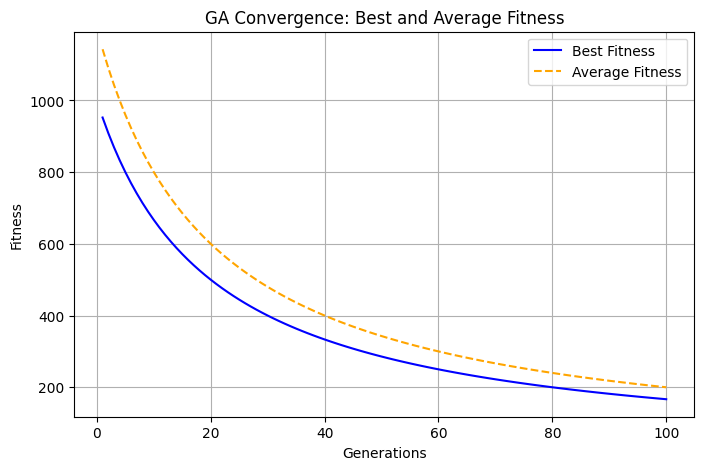
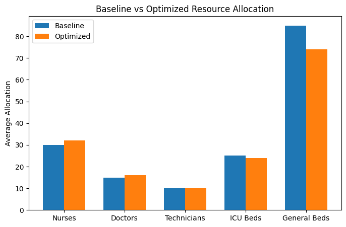
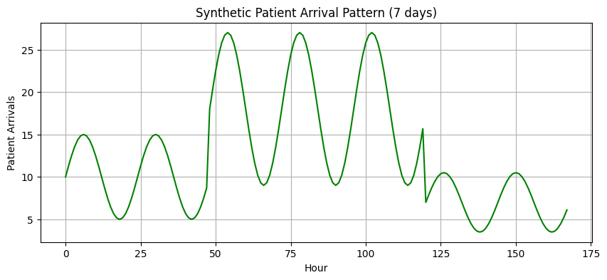

# Optimizing Hospital Resource Allocation During Peak Demand

A multi-objective optimization framework — combining **Mixed-Integer Linear Programming (MILP)**, **queueing theory**, and a **genetic algorithm (GA)** — for allocating hospital staff, beds, and equipment during seasonal outbreaks or pandemic surges. The repository contains the full technical report and an interactive React dashboard that lets a user explore staffing decisions under different demand scenarios.

<p align="center">
  
  
</p>

## Problem

Sudden surges in patient arrivals — seasonal outbreaks, pandemics — place extreme pressure on hospital staff, beds, and equipment. Static, historical-average-based planning fails to capture this dynamic, uncertain demand, leading to long patient wait times, staff burnout, and unnecessary cost. This project frames the problem as a constrained multi-objective optimization: for every time period, decide how many staff to schedule, how many beds to open, and how much equipment to deploy, so as to:

- minimize patient waiting time
- maximize resource utilization
- balance staff workload
- reduce operational cost

## Approach

1. **MILP formulation** — decision variables for staff (by category), beds, and equipment per time period, subject to service-capacity and resource-availability constraints.
2. **Queueing theory (M/M/c)** — patient waiting time in each period is approximated from the arrival rate and available service capacity, using Little's Law and the utilization ratio ρ = λ / (c·μ).
3. **Multi-objective genetic algorithm** — because the objectives conflict (lower cost vs. shorter waits), a GA searches for Pareto-efficient allocations: it encodes a staffing plan as a chromosome, evaluates fitness as a weighted, penalty-adjusted combination of waiting time, cost, and workload variance, and evolves the population via tournament selection, two-point crossover, and Gaussian mutation.
4. **Synthetic case study** — a 7-day / 168-hour hospital scenario with realistic diurnal, weekly, and 80% pandemic-surge demand patterns, three staff categories, and two resource types, used to validate the framework end to end.
5. **Interactive dashboard** — a lightweight, closed-form version of the allocation logic exposed as a web app, so scenarios can be configured and explored interactively (see [`dashboard/`](dashboard/)).

Full derivations, constraints, and the complete objective functions are in the [written report](report/report.pdf).

## Results (synthetic case study)

Comparing a static baseline allocation against the GA-optimized allocation over the simulated 7-day surge:

| Metric | Baseline | Optimized | Improvement |
|---|---:|---:|---:|
| Total waiting time (hrs) | 705.6 | 289.3 | **59.0% ↓** |
| Avg. wait per patient (hrs) | 4.20 | 1.72 | **59.0% ↓** |
| Total cost (7 days) | $319,200 | $276,150 | **13.5% ↓** |
| Resource utilization | 72% | 87% | **+15 pts** |
| Workload variance (std) | 15.3 | 8.9 | **41.8% ↓** |
| Constraint violations | 23 periods | 0 periods | **100% feasible** |

The improvement in waiting time was statistically significant (paired t-test, p < 0.001). A sensitivity analysis over the objective weights and over surge intensity (1.0×–2.0×) is also included in the report, quantifying the cost–quality trade-off (e.g., shifting weight toward service quality cuts wait time but raises cost).

<p align="center">
  
</p>

## Repository structure

```
.
├── report/
│   ├── report.pdf          # compiled technical report
│   ├── report.tex          # LaTeX source
│   ├── image1.png, image2.png, image3.png   # figures referenced by report.tex
│   └── figures/            # copies of the figures, used by this README
└── dashboard/
    ├── src/                # React + TypeScript source
    ├── supabase/migrations # Postgres schema for persistence
    └── README.md           # dashboard-specific setup & architecture notes
```

## Dashboard

The `dashboard/` folder contains a React + TypeScript + Tailwind app for interactively configuring a demand scenario, running the allocator, and reviewing results, a 24-hour patient-flow simulation, and side-by-side scenario comparisons, backed by Supabase for persistence. See [`dashboard/README.md`](dashboard/README.md) for setup instructions and an architecture overview.

> **Note:** the dashboard uses a fast, closed-form heuristic (derived from the M/M/c queueing approximation) for instant, in-browser feedback, rather than solving the full MILP/GA formulation live. The report documents and evaluates the complete MILP + genetic-algorithm methodology.

## Tech stack

- **Optimization / analysis:** MILP, M/M/c queueing theory, genetic algorithms
- **Dashboard:** React 18, TypeScript, Vite, Tailwind CSS, Supabase (Postgres)
- **Report:** LaTeX

## Limitations & future work

- The queueing model assumes exponential service times and homogeneous patients (no acuity/priority differentiation).
- Arrivals are treated as a known forecast rather than under explicit uncertainty.
- Shift continuity, staff preferences, and union/rostering rules are not modeled.

Planned extensions (discussed in the report): stochastic programming under demand uncertainty, patient segmentation by acuity, G/G/c queues for more realistic service-time variability, and real-time/online re-optimization.

## References

- Patel, V., Deodhar, A., & Birru, D. (2025). *A Multi-Objective Genetic Algorithm for Healthcare Workforce Scheduling.* arXiv:2508.20953.
- Mohamed, M. F., Eltoukhy, M. M., Al Ruqeishi, K., & Salah, A. (2023). *An Adapted Multi-Objective Genetic Algorithm for Healthcare Supplier Selection Decision.* Mathematics, 11(6), 1537.
- Yinusa, A., & Faezipour, M. (2023). *Optimizing Healthcare Delivery: A Model for Staffing, Patient Assignment, and Resource Allocation.* Applied System Innovation, 6(5), 78.
- Salami, A., Afshar-Nadjafi, B., & Amiri, M. (2023). *A Two-Stage Optimization Approach for Healthcare Facility Location-Allocation Problems With Service Delivering Based on Genetic Algorithm.* International Journal of Public Health.
- Green, L. (2006). *Queueing Analysis in Healthcare.* In Handbook of Healthcare Operations Management, Columbia Business School.

## Author

**Funmilayo Adegoroye** — Nursing graduate (First Class Honours, University of Ibadan) with research interests in nursing education, workplace bullying & incivility, and gender and health. This project applies operations-research methods to a healthcare operations problem.

## License

[MIT](LICENSE)
